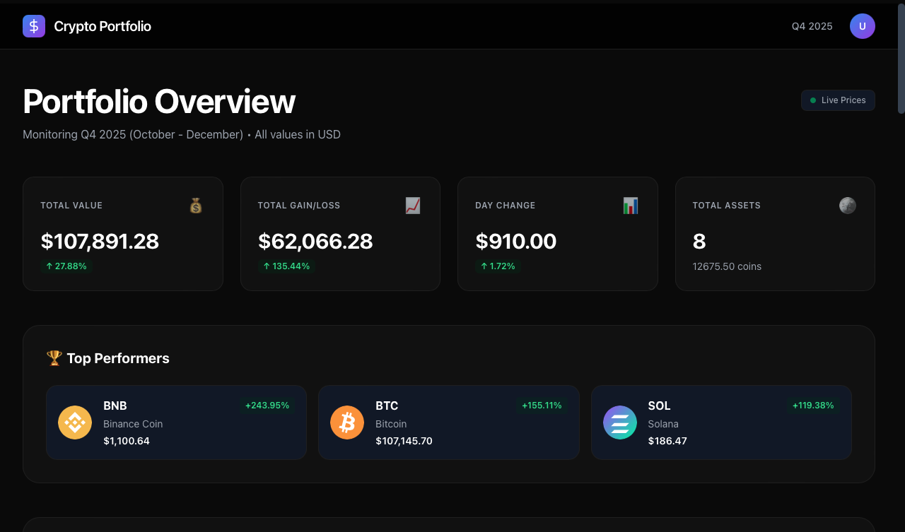
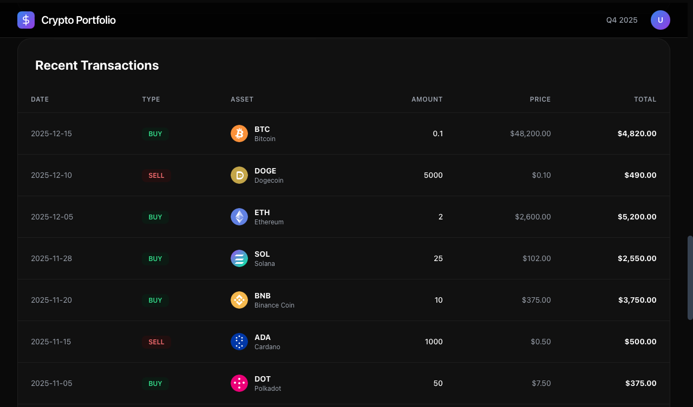
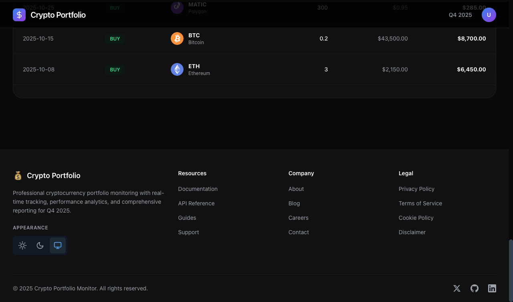

# 📊 Crypto Portfolio Live

A modern, minimalist cryptocurrency portfolio tracker built with Next.js, featuring real-time price updates and elegant data visualization.

[](https://nextjs.org/)
[](https://reactjs.org/)
[](https://tailwindcss.com/)
[](LICENSE)

## ✨ Features

- **Real-time Crypto Prices** — Live cryptocurrency data powered by CoinMarketCap API
- **Minimalist Design** — Clean, modern interface with smooth animations
- **Interactive Charts** — Beautiful data visualization with Chart.js
- **Responsive Layout** — Seamless experience across all devices
- **Performance Optimized** — Built with Next.js 15 for lightning-fast performance

## 🚀 Tech Stack

| Technology | Version | Purpose |
|------------|---------|---------|
| [Next.js](https://nextjs.org/) | 15.5.6 | React framework with App Router |
| [React](https://reactjs.org/) | 19.2.0 | UI library |
| [Tailwind CSS](https://tailwindcss.com/) | 3.4.17 | Utility-first CSS framework |
| [Chart.js](https://www.chartjs.org/) | 4.5.1 | Data visualization |
| [React Chart.js 2](https://react-chartjs-2.js.org/) | 5.3.0 | React wrapper for Chart.js |

## 📦 Installation

```bash
# Clone the repository
git clone https://github.com/esakrissa/crypto-portfolio-live.git

# Navigate to project directory
cd crypto-portfolio-live

# Install dependencies
npm install

# Run development server
npm run dev
```

Open [http://localhost:3000](http://localhost:3000) to view the application.

## 🛠️ Available Scripts

```bash
npm run dev      # Start development server
npm run build    # Build for production
npm run start    # Start production server
npm run lint     # Run ESLint
```

## 🎨 Design Philosophy

This project showcases a **minimalist and modern design approach**, focusing on:

- **Clean Typography** — Carefully selected fonts and spacing
- **Subtle Animations** — Smooth transitions and micro-interactions
- **Color Harmony** — Thoughtful color palette with dark mode support
- **White Space** — Strategic use of negative space for clarity
- **Data Clarity** — Information hierarchy that guides the eye

## 📱 Screenshots

### Main Dashboard

*Real-time cryptocurrency portfolio overview with live prices and performance metrics*

### Transaction History

*Detailed transaction records with filtering and sorting capabilities*

### Theme Switcher

*Seamless theme switching between Light, Dark, and System modes*

## 🔑 API Configuration

This project uses the CoinMarketCap API for live cryptocurrency data. To set up:

1. Get your free API key from [CoinMarketCap](https://coinmarketcap.com/api/)
2. Create a `.env.local` file in the root directory
3. Add your API key:

```env
NEXT_PUBLIC_CMC_API_KEY=your_api_key_here
```

## 🌟 Key Highlights

- **Modern Next.js 15** with App Router architecture
- **React 19** with latest features and improvements
- **Tailwind CSS 3.4** for powerful styling capabilities
- **Type-safe** development experience
- **Production-ready** with optimized build configuration

## 📄 License

This project is open source and available under the [MIT License](LICENSE).

## 🤝 Contributing

Contributions, issues, and feature requests are welcome! Feel free to check the [issues page](https://github.com/esakrissa/crypto-portfolio-live/issues).

## 👨‍💻 Author

**Esa Krissa**

- GitHub: [@esakrissa](https://github.com/esakrissa)

---

Made with ❤️ using Next.js

